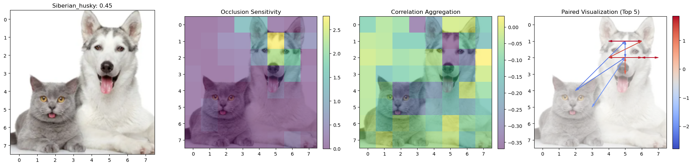
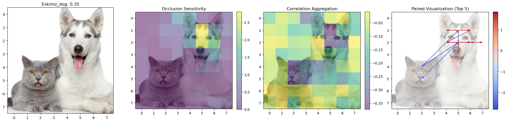
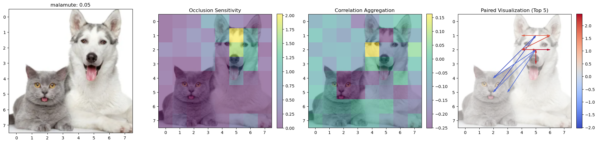
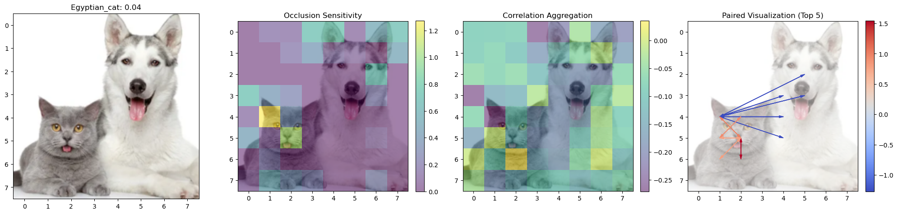
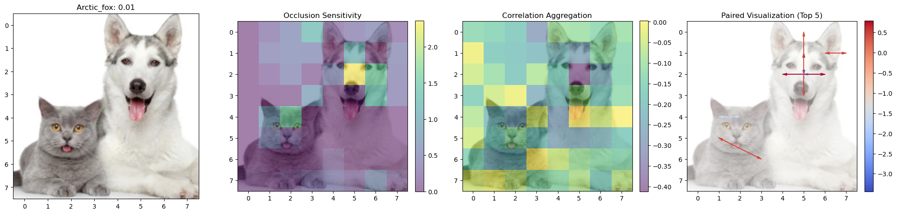

# COSMAX: Correlated Occlusion Sensitivity for Model-Agnostic Explainability

Allen Mi - May 5, 2024

## Abstract

Despite the impressive performance of deep learning models on complex tasks, explaining their predictions remains a key challenge. Current techniques like occlusion sensitivity neglect interactions between input regions, providing an incomplete picture of model reasoning. We propose COSMAX, an extension of occlusion that captures correlations between input patches by measuring the impact of their joint exclusion. COSMAX identifies competing patches with redundant information and complementary patches that cooperate to drive predictions. We demonstrate on an ImageNet-1K classification model that COSMAX provides richer and more faithful explanations compared to standard occlusion. We show that COSMAX is capable of highlighting important object parts and their interactions. COSMAX is model-agnostic and sheds light on how deep models leverage multiple input regions to make decisions, a key step towards human-aligned explainable AI.

## Directory Structure

- `img/`: Sample images used by the evaluation notebook
- `cosmax.ipynb`: Evaluation notebook with output cells retained
- `occlusion.py`: Implementation of single and simultaneous occlusion
- `README.md`: This README file
- `requirements.yml`: Dependencies. Invoke `conda env create -f requirements.yml`

## Showcase

Explanations with occlusion sensitivity, correlation aggregation and paired visualization. The five rows correspond to the top five labels in the model's prediction, ranked in descending order. Higher values of correlation aggregation indicate a competing inclination, and lower values indicate a complementary inclination. The top five pairs of competing and complementing patches are highlighted by red and blue arrows respectively.

